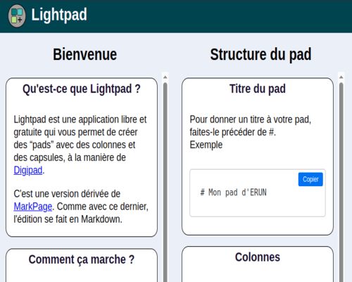

- Cédric Eyssette
- Professeur de philosophie
- Enseignant en DNL Anglais
- Chargé de projet à la DRANE site de Lyon
-     

# Les sites et outils numériques que je propose

## Cours, formations et ressources en philosophie

### Philosophie (terminales)

**Des cours de philosophie** tronc commun en série générale ou technologique, mais aussi des cours de **HLP** et en **DNL Anglais/Philosophie**.

https://eyssette.forge.apps.education.fr/cours/

### Formations

**Des formations** sur le numérique, sur le cinéma en philosophie et des formations pédagogiques avec le groupe ressources de l'académie de Lyon

https://eyssette.forge.apps.education.fr/cours/#formations

### Ressources pour les collègues

**Des ressources pour l'enseignement de la philosophie** à destination des collègues : base de données de sujets, outils pour la correction des copies …

https://eyssette.forge.apps.education.fr/ressources-generales-enseignement-philosophie/

## Logiciels en ligne libres et gratuits

### A4

 

**A4** permet de mettre en forme automatiquement un texte de manière optimale sur une page A4 prête à imprimer

https://a4.forge.apps.education.fr/

### Argument map

 

**Argument map** permet de créer des schémas d'arguments afin de mettre en évidence la structure du raisonnement et les objections possibles

https://eyssette.forge.apps.education.fr/argument-map/

### CartesMD

 

**CartesMD** permet de créer des cartes à jouer en Markdown, qui peuvent servir pour des révisions de cours, pour des formations …

https://cartesMD.forge.apps.education.fr

### ChatMD

 

**ChatMD** est un chatbot que l'on peut configurer avec un fichier en Markdown

https://chatmd.forge.apps.education.fr/

### CSE : Custom Searx Engine

 

**CSE** est un outil pour créer un moteur de recherche personnalisé qui fera des recherches exclusivement sur une liste de sites que l'on définit soi-même dans un fichier en Markdown

https://cse.forge.apps.education.fr/

### Dataview

 

**Dataview** permet de transformer des données au format CSV ou Markdown en un tableau avec un outil de recherche et de classement des données

https://dataview.forge.apps.education.fr/

### FlashMD

 

**FlashMD** permet de créer des flashcards en Markdown et de les imprimer ou de les réviser en ligne.

https://flashmd.forge.apps.education.fr/

### Flipbook

 

**Flipbook** permet de créer facilement un livre numérique que l'on peut feuilleter en ligne à partir d'un simple fichier Markdown (sur la forge ou sur CodiMD).

https://flipbook.forge.apps.education.fr/

### Lightpad

 

**Lightpad** permet de créer un pad avec des capsules, la possibilité d'organiser en colonnes, avec des tags, un outil de recherche très rapide et des filtres automatiques.

https://lightpad.forge.apps.education.fr/

### Marknews

 

**Marknews** permet de se faire un tableau de bord de flux RSS et d'organiser sa veille, à partir d'un fichier en Markdown (par exemple sur CodiMD)

https://marknews.forge.apps.education.fr/

### Markpage

 

**Markpage** permet de faire, comme Glide, un minisite web / une appli mobile à partir d'un fichier en Markdown (par exemple sur CodiMD)

https://markpage.forge.apps.education.fr/

### MemoryMD

 

**MemoryMD** permet de créer rapidement un jeu en ligne de _Memory_, combinant textes, images ou sons dans toutes les configurations possibles.

https://memorymd.forge.apps.education.fr/

### myMarkmap

 

**myMarkmap** est un outil pour créer des cartes mentales en Markdown

https://myMarkmap.forge.apps.education.fr/

### PDF2flip

 

**PDF2flip** permet de transformer un PDF en un livre numérique à feuilleter

https://pdf2flip.forge.apps.education.fr/

### Text2quiz

 

**Text2quiz** permet de créer automatiquement un quiz à partir d'un simple fichier texte. 13 types de question sont possibles : vrai/faux, QCM, question/réponse, textes à trous, flashcards, remise en ordre, étiquettes à positionner …

https://text2quiz.vercel.app/

## D'autres ressources

### Pour CodiMD

**CodiMD** sur AppsEdu permet d'écrire du Markdown en ligne (de manière collaborative). Voici **des modèles** pour écrire des dialogues type sms, faire des flaschards, un cahier de textes, le commentaire d'un texte, un mur d'images, une frise chronologique, un padlet, des cartes à jouer …

https://codimd.apps.education.fr/s/bGcFVkgLS

### Pour faire des schémas

**Graphviz** permet de créer des schémas à partir d'un texte en respectant une syntaxe particulière. Je propose plusieurs modèles pour faire des distinctions théoriques, des schémas d'arguments, des plans …

https://forge.apps.education.fr/eyssette/graphviz-templates

**Mermaid** permet de faire la même chose, avec une syntaxe différente

https://forge.apps.education.fr/eyssette/mermaid-diagrams

### Pour faire un diaporama

**Marp** est un outil qui permet de transformer du Markdown en un diaporama. **Teaching Theme** est un thème pour cet excellent outil
https://forge.apps.education.fr/eyssette/teaching-theme-for-marp

**ViteUnDiapo** permet de créer très rapidement un diaporama simple à partir d'un texte en Markdown
https://eyssette.forge.apps.education.fr/vite-un-diapo/

**weenote-reloaded** est l'outil sur lequel se fonde ViteUnDiapo
https://forge.apps.education.fr/eyssette/weenote-reloaded

### Pour la philosophie

**Mark(down)Papers** permet de corriger des copies en Markdown
https://eyssette.forge.apps.education.fr/mark-down-papers/

**Évaluation rapide** permet de rapidement estimer la note d'une copie
https://eyssette.forge.apps.education.fr/evaluation-rapide/

**PhiloMots** est un jeu du type Wordle / Sutom, mais avec des termes ou des thèmes philosophiques
https://eyssette.forge.apps.education.fr/philomots/

### D'autres petites applications

**Apprendre les prénoms** : un outil pour mémoriser plus facilement les prénoms de ses élèves à partir des trombinoscopes sur Pronote
https://eyssette.forge.apps.education.fr/apprendre/prenoms.html

**Cards** : un thème pour Marp qui permet de créer des documents au format cartes à jouer
https://forge.apps.education.fr/eyssette/cards

**Calendrier-avent** : un outil pour créer un calendrier de l'avent en ligne
https://eyssette.forge.apps.education.fr/calendrier-avent

**CombienDeMots** : un compteur de mots qui permet aussi d'estimer le temps de lecture et d'écriture d'un texte
https://eyssette.forge.apps.education.fr/combiendemots/

**InfosLivre** : un script qui récupère les informations d'un livre quand on est sur la page de l'un des sites reconnus par le script.
https://eyssette.forge.apps.education.fr/infoslivre/

**MDgenerator** : un outil pour générer du Markdown à partir d'un template
https://mdgenerator.forge.apps.education.fr/